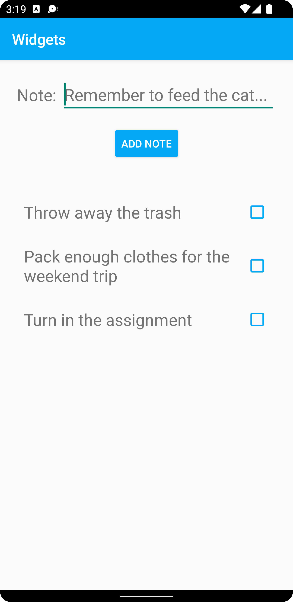

# Report

This assignment makes use of the [ConstraintLayout](https://developer.android.com/training/constraint-layout) to build more complex designs, without having to structure components within a deeply nested hierarchy. Instead, components are positioned in relation to their parent, or to other components.

## Example

This is an example of a component that has been positioned using a _ConstraintLayout_ as its immediate parent. Note how the attributes constrain 3/4 directions, leaving the start/left constraint undefined. This works, because the component has enough information to determine its position within the general layout.

```java
<CheckBox
    android:id="@+id/note_checkbox"
    android:layout_width="wrap_content"
    android:layout_height="wrap_content"
    android:buttonTint="@color/blue"
    app:layout_constraintBottom_toBottomOf="parent"
    app:layout_constraintEnd_toEndOf="parent"
    app:layout_constraintTop_toTopOf="parent" />
```

## Components

This application builds upon the following components.

- TextView
- EditText
- Button
- CheckBox

## Screenshot

<p align="center">
  
</p>
